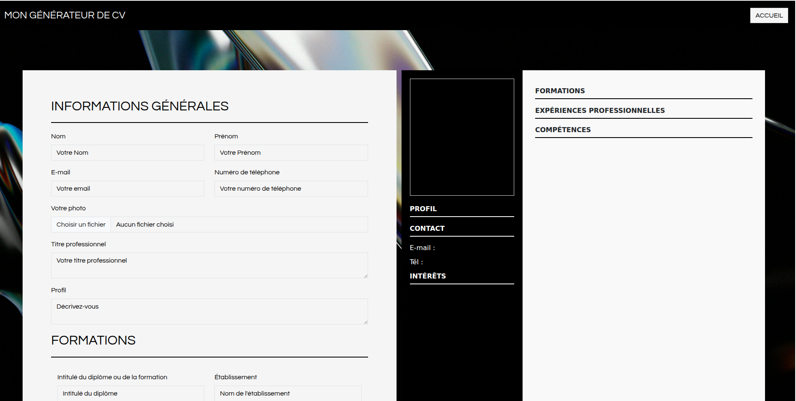
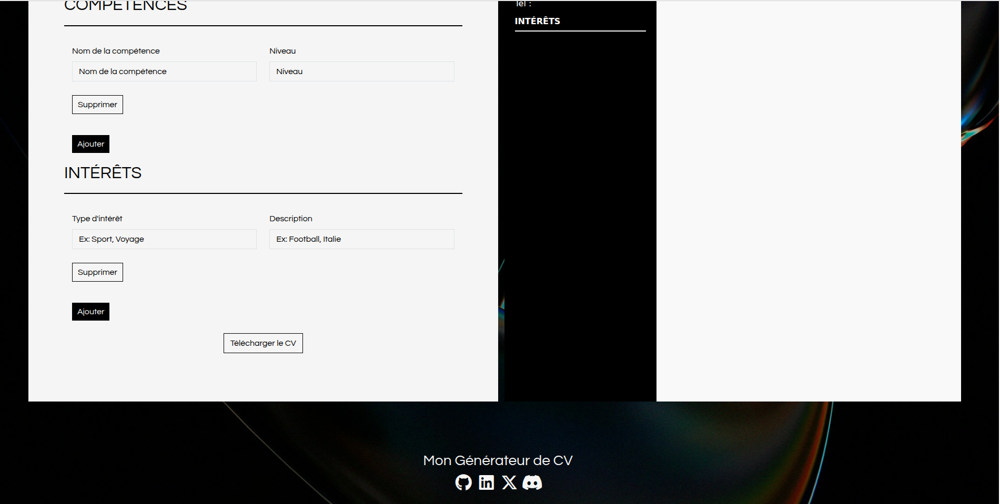

# Mon Générateur de CV
---

## 👤 Auteur
- **Anass** - [@Anassi-coder](https://github.com/Anassi-coder)

## Aperçu du projet 

## Fonctionnalités

- Formulaire dynamique : Ajout/Suppression de formations, expériences et compétences via **JavaScript**.
- Aperçu en temps réel : Visualisez les modifications sur le design du CV avant la génération.
- Gestion d'images : Upload de photo de profil convertie en **Base64** pour une intégration parfaite dans le PDF.
- Design moderne : Mise en page élégante avec une barre latérale sombre et une typographie soignée.

## Guide d'installation

1. Prérequis 

- PHP 8 installé
- Linux installé

2. Clonez le projet 

- Copiez le code SSH du dépôt.
- Depuis votre terminal, écrivez la commande **git clone** , puis collez le **code SSH** du dépôt à la suite

3. Installer les dépendances

- Lancez la commande **composer install** depuis votre terminal local.

## Utilisation 

1. Placez vous à l'intérieur du dépôt que vous venez de cloner à l'aide de la commande **cd nom du dépôt**

- Lancez le serveur PHP local à l'aide de la commande **php -S localhost:8000**

2. Ouvrez votre navigateur et accédez au site

- Une fois que vous accédez au site, vous arriverez sur une page d'accueil qui vous redirigera vers le formulaire.

- remplissez le formulaire (Informations générales, Photo de profil, Formations, Expériences...).
- Cliquez sur "Télécharger le CV" pour générer et télécharger votre PDF en un clic.

## Stack
- **Backend :** PHP 8.x
- **Librairie PDF :** [Dompdf](https://github.com/dompdf/dompdf)
- **Frontend :** HTML5, CSS3 (Bootstrap 5), JavaScript (Vanilla)
- **Gestionnaire de dépendances :** Composer